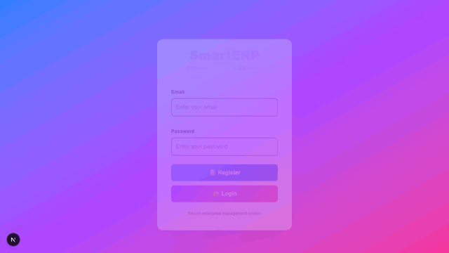

<p align="center">
  
</p>

<p align="center">
  
</p>

A modern, full-stack Enterprise Resource Planning system designed for small to medium businesses. Built with cutting-edge web technologies, SMART-ERP provides a comprehensive solution for managing inventory, customers, suppliers, and financial transactions.

<p align="center">
  
  
  
  
  
</p>

---

## 🎬 Demo

<p align="center">
  
</p>

<p align="center"><sub>Register &rarr; Dashboard &rarr; Stock Items &rarr; Customer Ledger &rarr; Sales Voucher &rarr; Reports</sub></p>

---

## ✨ Features

### 🔐 Authentication & Security
- User registration and login with JWT tokens
- Secure password hashing with bcrypt
- Token-based API authentication
- Protected routes and pages

### 📦 Stock Management
- Add, edit, and delete inventory items
- Track quantity and pricing
- Real-time stock updates
- Inventory dashboard

### 👥 Ledger Management
- Customer ledger tracking
- Supplier ledger management
- Customer and supplier profiles
- Balance tracking

### 📝 Voucher System
- Sales voucher creation
- Purchase voucher management
- Automatic date tracking
- Party-wise transaction records

### 📊 Reports & Analytics
- Balance Sheet reports
- Profit & Loss statements
- Stock summary reports
- Sales summary analytics

### 🎨 User Interface
- Responsive design for all devices
- Modern, clean UI with Tailwind CSS
- Smooth animations and transitions
- Intuitive navigation
- Real-time loading states
- Error handling with user feedback

---

## 🛠️ Tech Stack

### Frontend
| Technology | Purpose |
|---|---|
| **Next.js 16** | React framework with server-side rendering |
| **React 19** | UI library |
| **TypeScript** | Type-safe JavaScript |
| **Tailwind CSS 4** | Utility-first CSS framework |
| **Context API** | State management |

### Backend
| Technology | Purpose |
|---|---|
| **FastAPI** | Modern Python web framework |
| **SQLAlchemy** | ORM for database operations |
| **Pydantic** | Data validation |
| **Alembic** | Database migrations |
| **Python-Jose** | JWT token handling |

### Database
| Technology | Purpose |
|---|---|
| **PostgreSQL** | Primary database |
| **SQLite** | Local development option |

### DevOps
| Technology | Purpose |
|---|---|
| **Docker** | Containerization |
| **Docker Compose** | Multi-container orchestration |
| **Uvicorn** | ASGI server |

---

## 🚀 Quick Start

### Prerequisites
- Node.js 16+ and npm
- Python 3.8+
- PostgreSQL 12+ (or SQLite for development)
- Git

### Frontend Setup

```bash
# Navigate to frontend directory
cd frontend

# Install dependencies
npm install

# Start development server
npm run dev

# Build for production
npm run build

# Start production server
npm start
```

**Frontend running at:** http://localhost:3000

### Backend Setup

```bash
# Navigate to backend directory
cd backend

# Create virtual environment
python -m venv .venv

# Activate virtual environment
# On Windows:
.\.venv\Scripts\Activate.ps1
# On macOS/Linux:
source .venv/bin/activate

# Install dependencies
pip install -r requirements.txt

# Run database migrations
alembic upgrade head

# Start development server
uvicorn app.main:app --reload
```

**Backend running at:** http://127.0.0.1:8000

### Docker Setup (Recommended)

```bash
# Build and start all services
docker-compose up --build

# Services will start:
# - Frontend: http://localhost:3000
# - Backend: http://localhost:8000
# - PostgreSQL: localhost:5432
```

---

## 📁 Project Structure

```
SMART-ERP/
├── frontend/                    # Next.js frontend application
│   ├── app/
│   │   ├── context/            # React Context for global state
│   │   ├── lib/                # Utility functions
│   │   ├── dashboard/          # Dashboard page
│   │   ├── stock/              # Stock management
│   │   ├── ledger/             # Ledger pages
│   │   ├── voucher/            # Voucher pages
│   │   ├── reports/            # Reports page
│   │   ├── page.tsx            # Login page
│   │   └── layout.tsx          # Root layout
│   ├── public/                 # Static assets
│   ├── package.json
│   └── tsconfig.json
│
├── backend/                     # FastAPI backend application
│   ├── app/
│   │   ├── models/             # SQLAlchemy models
│   │   ├── schemas/            # Pydantic schemas
│   │   ├── routes/             # API endpoints
│   │   └── main.py             # Application entry point
│   ├── migrations/             # Alembic migrations
│   ├── requirements.txt
│   └── .env.example
│
├── docker-compose.yml          # Docker Compose configuration
└── README.md                   # Project documentation
```

---

## 🔌 API Endpoints

### Authentication
```
POST   /auth/register          # User registration
POST   /auth/login             # User login
GET    /auth/me                # Get current user
```

### Stock Management
```
GET    /stock                  # List all stock items
POST   /stock                  # Create stock item
GET    /stock/{id}             # Get stock item details
PUT    /stock/{id}             # Update stock item
DELETE /stock/{id}             # Delete stock item
```

### Ledger
```
GET    /ledger/{type}          # List ledger entries (customer/supplier)
POST   /ledger/{type}          # Add ledger entry
GET    /ledger/{type}/{id}     # Get ledger entry details
PUT    /ledger/{type}/{id}     # Update ledger entry
DELETE /ledger/{type}/{id}     # Delete ledger entry
```

### Voucher
```
GET    /voucher/{type}         # List vouchers (sales/purchase)
POST   /voucher/{type}         # Create voucher
GET    /voucher/{type}/{id}    # Get voucher details
DELETE /voucher/{type}/{id}    # Delete voucher
```

### Reports
```
GET    /reports/balance-sheet  # Balance sheet report
GET    /reports/profit-loss    # Profit & loss report
GET    /reports/stock-summary  # Stock summary report
GET    /reports/sales-summary  # Sales summary report
```

---

## 🧪 Development

### Running Tests
```bash
# Frontend tests (if configured)
cd frontend
npm test

# Backend tests
cd backend
pytest
```

### Database Migrations
```bash
# Create new migration
alembic revision --autogenerate -m "Description"

# Apply migrations
alembic upgrade head

# Rollback migration
alembic downgrade -1
```

### Code Quality
```bash
# Frontend linting
cd frontend
npm run lint

# Backend linting
cd backend
pylint app/
```

---

## 🔒 Security Features

- ✅ JWT-based authentication
- ✅ Password hashing with bcrypt
- ✅ CORS protection
- ✅ Input validation with Pydantic
- ✅ SQL injection prevention with SQLAlchemy ORM
- ✅ Protected API endpoints
- ✅ Secure token storage in localStorage (frontend)
- ✅ Type-safe data handling

---

## 📚 Documentation

### API Documentation
- **Swagger UI**: http://localhost:8000/docs
- **ReDoc**: http://localhost:8000/redoc

### Setup Guides
- [Frontend Setup](frontend/README.md)
- [Backend Setup](backend/README.md)

---

## 🤝 Contributing

Contributions are welcome! Please follow these steps:

1. Fork the repository
2. Create a feature branch (`git checkout -b feature/amazing-feature`)
3. Commit changes (`git commit -m 'Add amazing feature'`)
4. Push to branch (`git push origin feature/amazing-feature`)
5. Open a Pull Request

---

## 📝 License

This project is licensed under the MIT License - see the LICENSE file for details.

---

## 🎯 Roadmap

### Phase 1 (Current) ✅
- [x] Frontend UI with all pages
- [x] Authentication system
- [x] Basic CRUD operations
- [x] API integration

### Phase 2 (Upcoming)
- [ ] Advanced reporting with charts
- [ ] Multi-company support
- [ ] Batch operations
- [ ] Email notifications
- [ ] Mobile app

### Phase 3 (Future)
- [ ] AI-powered analytics
- [ ] Inventory forecasting
- [ ] Integration with payment gateways
- [ ] Supply chain management

---

## 💬 Support

For support, email support@smarterp.com or create an issue on GitHub.

---

## 👥 Authors

- **Development Team**: Smart ERP Contributors
- **Current Maintainer**: THARANIADEVI

---

## 🙏 Acknowledgments

- Thanks to all contributors and testers
- Built with ❤️ for the business community

---

**Last Updated**: July 1, 2026
**Status**: Active Development 🚀
